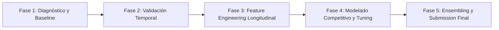

# 🏦 Plan Estratégico y Técnico de Desarrollo — Hackathon BCP

> **Desafío:** Predicción de primera conversión mensual de clientes bancarios.  
> **Métrica Oficial:** Coeficiente de Gini = $2 \times \text{AUC} - 1$  
> **Ventana Temporal:** Entrenamiento (Enero–Noviembre 2026: 110,100 filas) | Prueba (Diciembre 2026: 9,900 filas).  
> **Formato de Salida:** `id_cliente,prediccion` (probabilidad continua en $[0, 1]$).

---

## 🏗️ 1. Arquitectura Modular del Software

Para evitar la deuda técnica de los notebooks monolíticos y garantizar reproducibilidad, trazabilidad y velocidad de experimentación, el sistema se estructura de la siguiente manera:

```text
Hackaton/
│
├── data/                             # Datos originales inmutables
│   ├── train.csv                     # Enero a Noviembre 2026
│   ├── test.csv                      # Diciembre 2026
│   ├── metaData.csv                  # Diccionario de variables
│   └── sample_submission.csv         # Plantilla de entrega
│
├── src/                              # Librería modular del proyecto
│   ├── __init__.py
│   ├── metrics.py                    # Cálculo exacto de Gini y ROC-AUC
│   ├── validation.py                 # Purged Time-Series Cross Validation
│   ├── features.py                   # Transformaciones y features longitudinales/lags
│   ├── models.py                     # Envoltorios para LightGBM, CatBoost y XGBoost
│   └── ensemble.py                   # Rank Averaging y Blending de probabilidades
│
├── notebooks/                        # Espacio de análisis exploratorio
│   ├── 01_eda_longitudinal.ipynb     # Análisis de supervivencia y drift mensual
│   └── 02_feature_importance.ipynb   # Evaluación de aportes de variables
│
├── submissions/                      # Envíos generados versionados
│   ├── sub_v1_baseline_lgbm.csv
│   └── sub_final_ensemble.csv
│
├── check_submission.py               # Validador automático estricto de entrega
├── train_pipeline.py                 # Orquestador del pipeline de entrenamiento y predicción
└── requirements.txt                  # Dependencias del entorno
```

---

## 📅 2. Plan de Desarrollo por Fases y Entregables



### Tabla de Fases, Tareas y Entregables Concretos

| Fase | Tareas Principales | Entregables Concretos |
|---|---|---|
| **Fase 1: Diagnóstico y Baseline Rápido** | • Auditoría de tipos, nulos y duplicados.<br>• Construcción de la métrica oficial.<br>• Modelo base rápido con LightGBM sin features complejas.<br>• Verificación de tubería punta a punta. | • `src/metrics.py`<br>• `train_baseline.py`<br>• `submissions/sub_v1_baseline.csv` con validación de formato.<br>• Primer score de referencia en CV. |
| **Fase 2: Motor de Validación Purga-Temporal** | • Crear particiones de tiempo que simulen predecir un mes futuro completo.<br>• Evitar que el modelo aprenda del futuro o contamine folds con clientes repetidos. | • `src/validation.py` con `PurgedTimeSeriesSplit`.<br>• Reporte de estabilidad de CV mes a mes. |
| **Fase 3: Feature Engineering Longitudinal** | • Construcción de variables de trayectoria (lags, deltas de saldo, aceleración de interacción, tiempo acumulado sin convertir).<br>• Ratios financieros y scores digitales. | • `src/features.py` testeado contra fugas de datos.<br>• Matriz procesada con metadatos de importancia de variables. |
| **Fase 4: Modelado Competitivo y Tuning** | • Entrenamiento individual de la tríada: LightGBM, CatBoost y XGBoost.<br>• Ajuste de pesos por desbalance (`scale_pos_weight`, `auto_class_weights`).<br>• Selección de hiperparámetros orientados a AUC/Gini con early stopping. | • `src/models.py`<br>• Checkpoints de modelos entrenados.<br>• Logs de desempeño Out-Of-Fold (OOF). |
| **Fase 5: Ensembling y Submission Final** | • Calibración y combinación de modelos mediante *Rank Averaging* ponderado.<br>• Ejecución del chequeador de integridad.<br>• Generación del archivo final de competencia. | • `src/ensemble.py`<br>• `check_submission.py`<br>• `submissions/sub_final_ensemble.csv`. |

---

## ⚠️ 3. Los Retos Más Complicados de Abordar (Remarcados)

> [!CAUTION]
> ### 🚨 Reto 1: Estructura Longitudinal de Supervivencia (Hazard Bias & Right-Censoring)
> **Naturaleza del problema:**  
> Las filas no son clientes aislados; son observaciones de panel mensual `(id_cliente, mes)`. Si un cliente convierte (`objetivo = 1`), **es censurado y retirado del universo en los meses posteriores**.  
> **Consecuencia:**  
> Hay un sesgo de supervivencia intrínseco. Los clientes que llegan a los meses 10 y 11 (octubre/noviembre) o al mes 12 (diciembre) son clientes que ya demostraron una fuerte resistencia a convertir. Un modelo plano que mezcle filas sin ponderar cuántos meses lleva el cliente en observación perderá poder predictivo.

> [!WARNING]
> ### 🚨 Reto 2: Fuga de Datos (Data Leakage) por Validación Inadecuada
> **Naturaleza del problema:**  
> En problemas estándar se utiliza `KFold` aleatorio o `StratifiedKFold`. Aquí eso es **fatal**:
> 1. Si el registro de un cliente de junio cae en train y su registro de febrero cae en validación, el modelo usará información futura para predecir el pasado.
> 2. Si el mismo cliente está en train y test del fold, el modelo memoriza patrones del cliente en lugar de generalizar.  
> **Consecuencia:**  
> Un score de validación engañosamente alto (ej. Gini 0.92) que colapsará en el test real de diciembre.

> [!WARNING]
> ### 🚨 Reto 3: Mismatch Temporal y Estacionalidad Financiera de Diciembre
> **Naturaleza del problema:**  
> El conjunto de prueba corresponde **exclusivamente a Diciembre 2026 (`202612`)**.  
> En el sector bancario (y particularmente en Perú con el BCP):
> - Diciembre es el mes de pago de gratificaciones, bonos y aguinaldos de fin de año.
> - Aumenta drásticamente la liquidez transitoria, el uso de canales móviles y las compras navideñas.  
> **Consecuencia:**  
> Umbrales rígidos de saldo promedio o días sin transacción aprendidos en meses tranquilos (abril, julio) se comportan de manera distinta en diciembre. Se deben priorizar variables relativas (ratios y deltas) antes que montos absolutos.

> [!IMPORTANT]
> ### 🚨 Reto 4: Optimización Pura de Ranking (Gini) bajo Desbalance Severo
> **Naturaleza del problema:**  
> La tasa de conversión bancaria suele situarse entre el 3% y el 12%.  
> La métrica evaluada no es Accuracy ni F1-score con corte en 0.5:
> $$\text{Gini} = 2 \times \text{AUC} - 1$$
> **Consecuencia:**  
> No importa el valor absoluto de la probabilidad, sino **el orden relativo** de los 9,900 clientes del test. Al ensamblar modelos distintos (ej. LightGBM y CatBoost), sus probabilidades pueden estar en escalas distintas. Un promedio aritmético simple deteriora el ranking global.

---

## 💡 4. Soluciones Óptimas para Abordar el Sistema

### 🛡️ Solución 1: Esquema de Validación "Purged Time-Window Split"
Replicamos con exactitud la prueba: entrenar con una ventana de meses pasados y validar en el mes siguiente completo.

```python
# src/validation.py
import numpy as np

def get_time_series_splits(df, month_col='mes'):
    """
    Genera particiones temporales estrictas respetando el flujo cronológico.
    
    Split 1: Train <= 202607 | Val == 202608
    Split 2: Train <= 202608 | Val == 202609
    Split 3: Train <= 202609 | Val == 202610
    Split 4: Train <= 202610 | Val == 202611  (El más cercano a Diciembre)
    """
    splits = []
    val_months = [202608, 202609, 202610, 202611]
    
    for val_m in val_months:
        train_idx = df[df[month_col] < val_m].index.values
        val_idx = df[df[month_col] == val_m].index.values
        splits.append((train_idx, val_idx))
        
    return splits
```

---

### 🧬 Solución 2: Feature Engineering Longitudinal (Dinámicas sin Fuga)
Aprovechar el historial del cliente ordenando cronológicamente antes de calcular transformaciones.

```python
# src/features.py
import pandas as pd
import numpy as np

def build_features(df_train, df_test):
    """
    Concatena temporalmente para calcular lags históricos y separa de forma segura.
    """
    df = pd.concat([df_train, df_test], axis=0, ignore_index=True)
    df = df.sort_values(by=['id_cliente', 'mes']).reset_index(drop=True)
    
    # 1. Indicador de Inercia y Supervivencia
    df['meses_en_observacion'] = df.groupby('id_cliente').cumcount() + 1
    
    # 2. Deltas de Liquidez y Transaccionalidad
    df['prev_saldo'] = df.groupby('id_cliente')['saldo_promedio'].shift(1)
    df['delta_saldo'] = df['saldo_promedio'] - df['prev_saldo']
    df['ratio_cambio_saldo'] = df['delta_saldo'] / (df['prev_saldo'] + 1.0)
    
    # 3. Interacción y Digitalización
    df['digital_score'] = df['visitas_web_ultimos_90_dias'] * df['activo_movil'].astype(int)
    df['recencia_relativa'] = df['dias_ultima_interaccion'] / (df['dias_ultima_transaccion'] + 1.0)
    
    # 4. Capacidad y Carga Financiera
    df['deuda_estimada'] = df['ingresos'] * df['ratio_deuda_ingresos']
    df['saldo_sobre_ingreso'] = df['saldo_promedio'] / (df['ingresos'] + 1.0)
    df['saldo_neto_sobre_deuda'] = (df['saldo_promedio'] - df['deuda_estimada']) / (df['ingresos'] + 1.0)
    
    # 5. Segmentación de Productos
    df['intensidad_productos'] = df['numero_productos'] / (df['antiguedad_cuenta_meses'] + 1.0)
    
    # Rellenar lags iniciales (primer mes del cliente no tiene anterior)
    df['delta_saldo'] = df['delta_saldo'].fillna(0)
    df['ratio_cambio_saldo'] = df['ratio_cambio_saldo'].fillna(0)
    df.drop(columns=['prev_saldo'], inplace=True)
    
    # Separar train y test originales
    train_clean = df[df['mes'] < 202612].reset_index(drop=True)
    test_clean = df[df['mes'] == 202612].reset_index(drop=True)
    
    return train_clean, test_clean
```

---

### 🎯 Solución 3: Optimización Directa de Gini en Modelado
Configuración óptima de **LightGBM** para maximizar Gini:

```python
# src/models.py
import lightgbm as lgb
from sklearn.metrics import roc_auc_score

def eval_gini(preds, train_data):
    labels = train_data.get_label()
    auc = roc_auc_score(labels, preds)
    gini = 2.0 * auc - 1.0
    return 'gini', gini, True

def get_lgbm_params(scale_pos_weight=1.0):
    return {
        'objective': 'binary',
        'metric': 'auc',
        'boosting_type': 'gbdt',
        'learning_rate': 0.03,
        'num_leaves': 31,
        'max_depth': 6,
        'min_child_samples': 50,
        'subsample': 0.8,
        'colsample_bytree': 0.7,
        'scale_pos_weight': scale_pos_weight,
        'random_state': 42,
        'verbose': -1,
        'n_estimators': 1500
    }
```

---

### ⚖️ Solución 4: Ensamble por Rank Averaging (La Técnica Reina para Gini)
Al promediar los percentiles en lugar de las probabilidades crudas, se unifica la escala sin alterar la calidad del ordenamiento:

```python
# src/ensemble.py
from scipy.stats import rankdata

def rank_average(preds_dict, weights=None):
    """
    Normaliza las predicciones de cada modelo a rangos uniformes en [0, 1]
    y calcula el promedio ponderado.
    """
    if weights is None:
        weights = {name: 1.0 / len(preds_dict) for name in preds_dict}
        
    final_score = 0.0
    total_weight = sum(weights.values())
    
    for name, pred in preds_dict.items():
        norm_rank = rankdata(pred) / len(pred)
        final_score += (weights[name] / total_weight) * norm_rank
        
    return final_score
```

---

### 🔍 Solución 5: Validador Automático de Submission
Script de control para evitar descalificaciones antes de subir a la plataforma:

```python
# check_submission.py
import pandas as pd
import sys

def check(sub_path, test_path="data/test.csv"):
    sub = pd.read_csv(sub_path)
    test = pd.read_csv(test_path)
    
    print(f"Verificando archivo: {sub_path}...")
    
    # 1. Columnas exactas
    assert list(sub.columns) == ['id_cliente', 'prediccion'], (
        f"❌ Columnas inválidas: {list(sub.columns)}. Se esperaba ['id_cliente', 'prediccion']"
    )
    
    # 2. Número de filas
    assert len(sub) == len(test), (
        f"❌ Número de filas incorrecto: {len(sub)} (esperado: {len(test)})"
    )
    
    # 3. Mismos id_cliente en el mismo orden
    assert (sub['id_cliente'].values == test['id_cliente'].values).all(), (
        "❌ El orden de los id_cliente no coincide con el archivo de prueba"
    )
    
    # 4. Rango válido de probabilidad
    assert sub['prediccion'].between(0.0, 1.0).all(), (
        "❌ Hay valores fuera del rango permitido [0, 1]"
    )
    
    # 5. Sin nulos
    assert not sub['prediccion'].isna().any(), (
        "❌ Existen valores NaN / nulos en la columna prediccion"
    )
    
    print("✅ ¡Validación exitosa! El archivo cumple con el 100% de los requisitos del BCP.")

if __name__ == '__main__':
    archivo = sys.argv[1] if len(sys.argv) > 1 else "submissions/sub_v1_baseline.csv"
    check(archivo)
```

---

## 🏆 Resumen de Buenas Prácticas para Ganar

1. **Nunca uses `train_test_split` aleatorio ni `KFold` estándar.** La validación temporal es la única que te dirá la verdad sobre tu posición en el leaderboard privado.
2. **Prioriza el Feature Engineering de trayectorias (Deltas y Lags).** En datos tabulares bancarios, cómo evoluciona el cliente en el tiempo explica mucho más que su estado estático en un solo mes.
3. **El Ensamble debe ser por Rangos.** Combina LightGBM + CatBoost + XGBoost usando `rank_average`.
4. **Verifica siempre antes de enviar con `check_submission.py`.**
